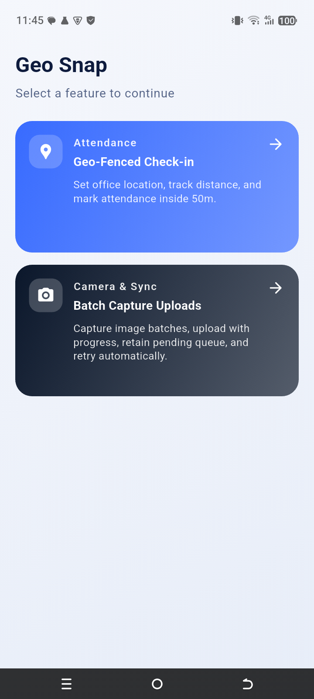
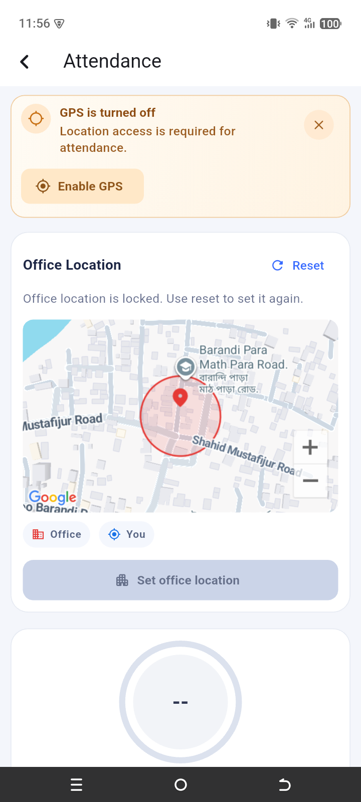
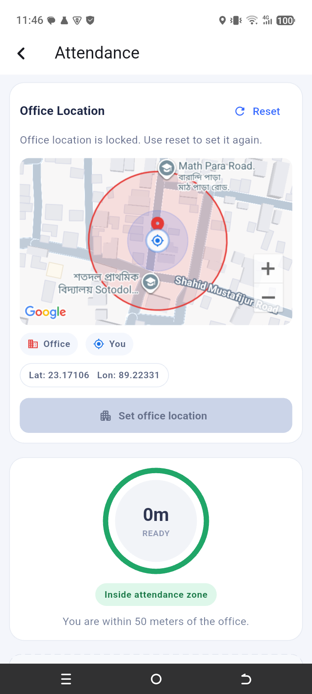
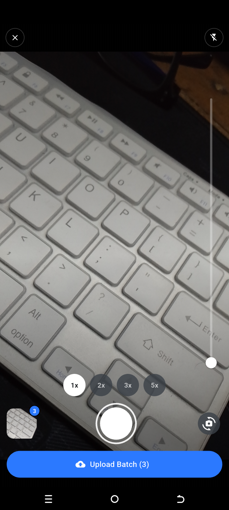
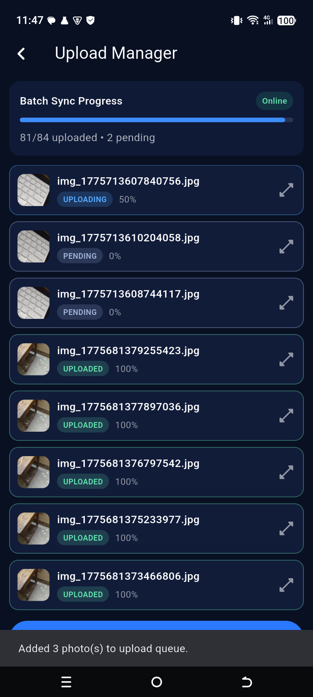
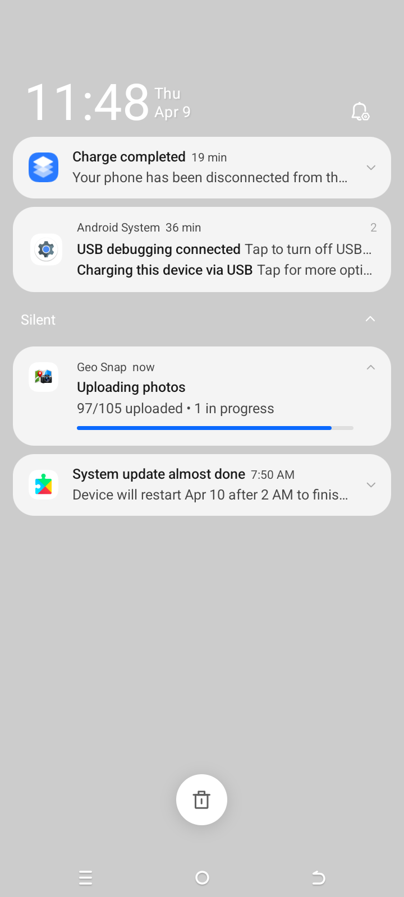

# GeoSnap

GeoSnap is a Flutter mobile application for location-aware attendance and camera-based batch upload flow. Users can lock an office location, mark attendance within radius, capture photo batches, and rely on offline queue + auto-retry when network connectivity returns.

## App Jouney

An end-to-end look at the product experience:

<p align="center">
  
  
  
</p>
<p align="center">
  
  
  
</p>

1. Feature-first home entry point
2. GPS-off guardrail that prompts location enablement before attendance
3. Geo-fenced attendance with live zone validation
4. Camera workflow for high-speed batch capture
5. Upload manager with per-item queue visibility
6. Background sync surfaced through system notifications

### Key Takeaways

- GeoSnap combines geofenced accuracy and field-friendly UX to make attendance hard to fake and easy to complete.
- The capture-to-upload pipeline is built for real-world instability: queue retention, retry behavior, and progress transparency are first-class.
- Users can continue working while sync runs in the background, with clear status feedback inside the app and at OS level.

## Project Structure / Approach

The project follows a layered feature-first architecture (`data` -> `domain` -> `presentation`) with `flutter_bloc` for predictable state handling. Core BLoC classes are `AttendanceBloc` (attendance/location workflow), `CameraBloc` (camera capture lifecycle), and `UploadQueueBloc` (offline queue, sync, and network-aware auto-resume).

## Generative AI Usage

Generative AI was used as a development accelerator for scaffolding, architecture reasoning, and performance-driven refactors. The prompts were context-specific and refined iteratively based on feature boundaries and quality goals.

Key usage patterns:
- Role-based prompting: used to generate clean architecture-friendly codebase structure and initial feature scaffolding.
- Domain-based prompting: used to generate targeted files for attendance tracking, camera flow, and upload queue handling.
- System-design context prompting: used to evaluate design trade-offs and flow correctness during implementation.

Example prompt snippets used:
- `Performance Requirements: The UI must remain smooth and responsive (no frame drops or freezes).`
- `Minimize unnecessary widget rebuilds using best practices (e.g., state management, selectors, const widgets).`
- `Mark widgets and variables as const wherever applicable.`
- `Avoid performance-heavy widgets (e.g., IntrinsicHeight, IntrinsicWidth) unless absolutely necessary.`

## How to Run

1. Clone the repository:
```bash
git clone <your-repo-url>
cd geosnap
```
2. Install dependencies:
```bash
flutter pub get
```
3. Run on a connected device/emulator:
```bash
flutter run
```
4. (Optional) Verify code quality:
```bash
flutter analyze
flutter test
```

## CI/CD (Main Branch Release APK)

GitHub Actions builds a release APK automatically on every push to `main` (including merged PRs).

- Workflow file: `.github/workflows/android-release-apk.yml`
- Output naming: `geo_snap_release_vX.Y.Z.apk` (derived from `version:` in `pubspec.yaml`)
- Current example (from `version: 1.0.0+1`): `geo_snap_release_v1.0.0.apk`
- Download location: GitHub Actions run artifacts
